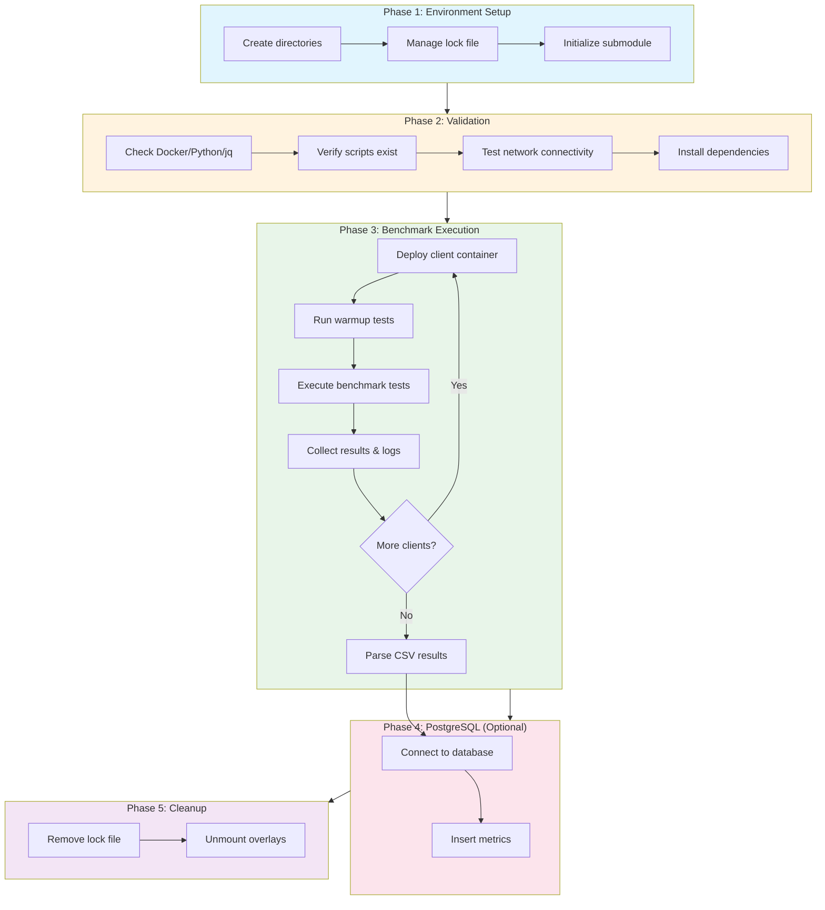

# Gas Benchmarks V2

Ansible-orchestrated gas benchmark suite for Ethereum execution clients.

**Quick Links**: [Getting Started](#getting-started) | [Running Benchmarks](#running-benchmarks) | [Advanced Topics](#advanced-topics) | [Debugging](#debugging--troubleshooting)

---

## Table of Contents

- [Getting Started](#getting-started)
  - [System Requirements](#system-requirements)
  - [Installation](#installation)
  - [Project Architecture](#project-architecture)
- [Running Benchmarks](#running-benchmarks)
  - [Your First Benchmark](#your-first-benchmark)
  - [Command Syntax](#command-syntax)
  - [Single-Client Benchmarks](#single-client-benchmarks)
  - [Multi-Client Comparative Benchmarks](#multi-client-comparative-benchmarks)
  - [Test Filtering](#test-filtering)
  - [Interpreting Results](#interpreting-results)
  - [Supported Clients](#supported-clients)
  - [Custom Docker Images](#custom-docker-images)
- [Advanced Topics](#advanced-topics)
  - [Configuration Customization](#configuration-customization)
  - [Custom Test Paths](#custom-test-paths)
  - [PostgreSQL Integration](#postgresql-integration)
  - [Submodule Updates](#submodule-updates)
  - [Five-Phase Execution Model](#five-phase-execution-model)
- [Debugging & Troubleshooting](#debugging--troubleshooting)
  - [Log Access](#log-access)
  - [Debugging Workflow](#debugging-workflow)
  - [Common Error Scenarios](#common-error-scenarios)
- [Quick Reference](#quick-reference)
- [FAQ](#faq)
- [Contributing](#contributing)

---

## Getting Started

This section guides you through installing the gas-benchmarks-v2 system and running your first benchmark within 15 minutes.

### System Requirements

**Operating System**:
- macOS (Intel or Apple Silicon)
- Linux (Ubuntu 20.04+, Debian 11+, or equivalent)
- Windows via WSL2 (not officially supported but may work)

**Required Software**:

| Tool | Minimum Version | Purpose |
|------|----------------|---------|
| Docker | 20.10 | Container runtime for Ethereum clients |
| Docker Compose | 2.0 | Container orchestration |
| Python | 3.10 | Ansible runtime and benchmark scripts |
| uv | Latest | Fast Python package installer (recommended) |
| Ansible Core | 2.15 | Orchestration framework |
| jq | 1.6 | JSON processing for results |
| make | Any | Build automation |
| Git | Any | Repository and submodule management |

**Hardware Recommendations**:
- CPU: 4+ cores
- RAM: 8GB+ (16GB recommended for multi-client)
- Disk: 20GB+ free space
- Network: Stable internet for Docker image downloads

### Installation

#### Step 1: Platform-Specific Prerequisites

**macOS**:

```bash
# Install Homebrew (if not already installed)
/bin/bash -c "$(curl -fsSL https://raw.githubusercontent.com/Homebrew/install/HEAD/install.sh)"

# Install required tools
brew install python@3.10 jq make git uv

# Install Docker Desktop
# Download from: https://www.docker.com/products/docker-desktop
# Launch Docker Desktop and ensure it's running
```

**Linux (Ubuntu/Debian)**:

```bash
# Update package list
sudo apt update

# Install Docker
sudo apt install -y docker.io docker-compose

# Start and enable Docker daemon
sudo systemctl start docker
sudo systemctl enable docker

# Add current user to docker group (logout/login required)
sudo usermod -aG docker $USER

# Install other tools
sudo apt install -y python3 python3-pip python3-venv jq make git

# Install uv (fast Python package installer)
curl -LsSf https://astral.sh/uv/install.sh | sh

# Logout and login for docker group changes to take effect
```

**Linux (CentOS/RHEL/Fedora)**:

```bash
# Install Docker
sudo dnf install -y docker docker-compose

# Start and enable Docker daemon
sudo systemctl start docker
sudo systemctl enable docker

# Add current user to docker group
sudo usermod -aG docker $USER

# Install other tools
sudo dnf install -y python3 python3-pip jq make git

# Install uv (fast Python package installer)
curl -LsSf https://astral.sh/uv/install.sh | sh
```

#### Step 2: Clone Repository

```bash
git clone https://github.com/dmitriy-b/gas-benchmarks-v2.git
cd gas-benchmarks-v2
```

#### Step 3: Install Ansible Environment

```bash
# Create Python virtual environment and install Ansible
make install
```

**Expected Output**:
```
==> Setting up Python environment...
Using uv for dependency management...
==> Creating virtual environment at .venv...
==> Installing Ansible and dependencies...
==> Environment ready!

To activate: source .venv/bin/activate
```

**Note**: The `make install` command automatically uses `uv` if available (faster), otherwise falls back to `pip`.

**Activate the virtual environment**:
```bash
source .venv/bin/activate
```

**Note**: You'll need to activate this environment in every new terminal session before running benchmarks.

#### Step 4: Initialize Test Artifacts

```bash
# Initialize gas-benchmarks submodule (contains test files)
make init-submodule
```

**Expected Output**:
```
==> Initializing gas-benchmarks submodule...
Submodule 'gas-benchmarks' (https://github.com/NethermindEth/gas-benchmarks.git) registered
Cloning into '/path/to/gas-benchmarks-v2/gas-benchmarks'...
✓ Submodule initialized: gas-benchmarks
```

This downloads the upstream [gas-benchmarks](https://github.com/NethermindEth/gas-benchmarks) repository containing test files and genesis configurations.

#### Step 5: Validate Prerequisites

```bash
# Verify all tools are installed and Docker is running
make prepare_tools
```

**Expected Output**:
```
==> Checking Docker...
Docker version 24.0.5, build ced0996
==> Checking Docker Compose...
Docker Compose version v2.20.2
==> Checking jq...
jq-1.6
==> Installing Python dependencies from gas-benchmarks/requirements.txt...
Requirement already satisfied: web3 in ./.venv/lib/python3.10/site-packages
✓ All tools prepared!
```

**Troubleshooting**:
- **"Docker daemon not running"**: Start Docker Desktop (macOS) or `sudo systemctl start docker` (Linux)
- **"jq: command not found"**: Install jq using your package manager
- **"Python version mismatch"**: Ensure Python 3.10+ is installed

**Installation Complete!** You're ready to run your first benchmark.

### Project Architecture

Understanding the system architecture helps you navigate configuration and troubleshoot issues.

**High-Level Flow**:

```
User Command → Makefile → Ansible Playbook → Ansible Roles → Docker Clients
                                  ↓
                          gas-benchmarks/
                          (submodule with test artifacts)
                                  ↓
                          Results (CSV/HTML) + PostgreSQL (optional)
```

**Five-Phase Execution Architecture**:



**Component Responsibilities**:

1. **Makefile**: Entry points for setup (`install`, `init-submodule`, `update-submodule`, `prepare_tools`, `clean`)
2. **Ansible Playbook** (`run_benchmarks.yml`): Orchestrates the four-phase execution workflow
3. **Ansible Roles**:
   - `environment_setup`: Creates directories, lock files, validates environment
   - `benchmark_validator`: Checks Docker, Python, jq, required scripts
   - `benchmark_runner`: Deploys clients, executes benchmarks, collects results
   - `postgres_publisher`: Publishes metrics to PostgreSQL (optional)
4. **gas-benchmarks Submodule**: External repository containing test files, genesis configs, and benchmark scripts
5. **Docker Containers**: Ethereum clients (Nethermind, Geth, Reth, etc.) running tests
6. **Results**: CSV/HTML files with gas consumption metrics

**Directory Structure**:

```text
gas-benchmarks-v2/
├── Makefile                    # Setup and maintenance commands
├── ansible.cfg                 # Ansible configuration
├── inventory/
│   └── hosts.yml              # Ansible inventory (localhost)
├── group_vars/
│   └── all.yml                # Default benchmark configuration
├── collections/ansible_collections/local/main/
│   ├── playbooks/
│   │   └── run_benchmarks.yml # Main orchestration playbook
│   └── roles/                 # Ansible roles (see above)
├── gas-benchmarks/            # Git submodule (test artifacts)
│   ├── eest_tests/           # EELS test payloads
│   ├── warmup-tests/         # Warmup test files
│   └── scripts/              # Genesis files and client configs
├── results/                   # Benchmark output (CSV/HTML)
├── logs/                      # Execution logs
└── src/                       # Benchmark v2 scripts (to be added)
    ├── run.sh
    ├── setup_node.py
    └── ...
```

**Data Flow**:

1. User sets parameters via CLI (`-e` flags) or `group_vars/all.yml`
2. Ansible playbook reads configuration and starts execution phases
3. For each client (sequentially):
   - Deploy Docker container with client software
   - Run warmup tests (if configured)
   - Execute benchmark tests (filtered if specified)
   - Collect results to `results/` / `gas-benchmarks/results` directory
4. Optionally publish metrics to PostgreSQL
5. Cleanup: Remove locks, unmount overlays

**External Dependencies**:

- **Upstream Repository**: [gas-benchmarks](https://github.com/NethermindEth/gas-benchmarks) - Test files and genesis configs
- **Docker Hub**: Client images (e.g., `ethpandaops/nethermind:performance`, `ethpandaops/geth:performance`)
- **PostgreSQL** (optional): Metrics storage for Grafana visualization

---

## Running Benchmarks

This section covers executing benchmarks from basic single-client runs to advanced multi-client comparisons.

### Your First Benchmark

**Goal**: Run a single-client benchmark with test filtering to verify your setup.

**Command**:

```bash
ansible-playbook collections/ansible_collections/local/main/playbooks/run_benchmarks.yml \
  -i inventory/hosts.yml \
  -e "benchmark_clients=['nethermind']" \
  -e "benchmark_filter='bn128'"
```

**What This Does**:
- Benchmarks the **Nethermind** client
- Runs only tests matching **"bn128"** (BN128 precompile tests)
- Generates CSV and HTML results in `results/` / `gas-benchmarks/results` directory

**Expected Execution Time**: 5-10 minutes (depending on hardware)

**Expected Output**:

```
PLAY [Ansible Benchmark Orchestration] *****************************************

TASK [Environment setup] *******************************************************
ok: [localhost]

TASK [Validate prerequisites] **************************************************
ok: [localhost]

TASK [Run benchmarks for each client] ******************************************
changed: [localhost] => (item=nethermind)

TASK [Publish results to PostgreSQL] *******************************************
skipping: [localhost]

PLAY RECAP *********************************************************************
localhost : ok=3 changed=1 unreachable=0 failed=0 skipped=1

Benchmark execution completed.
```

**View Results**:

```bash
# List result files
ls -lh gas-benchmarks/reports/

# Expected files:
# output_nethermind.csv
# raw_results_nethermind.csv
# index.html

# View CSV in terminal
cat gas-benchmarks/reports/output_*.csv

# Open HTML report in browser
open gas-benchmarks/reports/index.html  # macOS
xdg-open gas-benchmarks/reports/index.html  # Linux
```

**CSV Structure**:

The CSV contains performance metrics with the following columns:
- `Title`: Test name
- `Max (MGas/s)`, `p50 (MGas/s)`, `p95 (MGas/s)`, `p99 (MGas/s)`, `Min (MGas/s)`: Performance percentiles
- `N`: Number of runs
- `Description`: Test description
- `Start Time`, `End Time`, `Duration (ms)`: Timing information
- `FCU time (ms)`, `NP time (ms)`: Forkchoice and newPayload timings

### Command Syntax

All benchmarks use the `ansible-playbook` command with the following structure:

**Basic Syntax**:

```bash
ansible-playbook collections/ansible_collections/local/main/playbooks/run_benchmarks.yml \
  -i inventory/hosts.yml \
  -e "parameter1=value1" \
  -e "parameter2=value2"
```

**Required Parameters**:
- `-i inventory/hosts.yml`: Ansible inventory file (always localhost)
- `-e "benchmark_clients=[...]"`: List of clients to benchmark (required)

**Common Optional Parameters**:
- `-e "benchmark_filter='pattern'"`: Test name pattern filter
- `-e "benchmark_images={...}"`: Custom Docker image overrides
- `--tags postgres`: Enable PostgreSQL ingestion phase

**Example with Multiple Parameters**:

```bash
ansible-playbook collections/ansible_collections/local/main/playbooks/run_benchmarks.yml \
  -i inventory/hosts.yml \
  -e "benchmark_clients=['nethermind','geth']" \
  -e "benchmark_filter='bn128'"
```

### Single-Client Benchmarks

**Use Case**: Test a single Ethereum client with specific test filters.

**Example 1: Nethermind with BN128 Tests**

```bash
ansible-playbook collections/ansible_collections/local/main/playbooks/run_benchmarks.yml \
  -i inventory/hosts.yml \
  -e "benchmark_clients=['nethermind']" \
  -e "benchmark_filter='bn128'"
```

**Example 2: Geth with All Tests (No Filter)**

```bash
ansible-playbook collections/ansible_collections/local/main/playbooks/run_benchmarks.yml \
  -i inventory/hosts.yml \
  -e "benchmark_clients=['geth']"
```

**Result Location**:

- **CSV**: `gas-benchmarks/reports/output_{client}.csv`
- **HTML**: `gas-benchmarks/reports/index.html`
- **Logs**: `gas-benchmarks/logs/{client}_{timestamp}.log`

### Multi-Client Comparative Benchmarks

**Use Case**: Compare gas consumption and performance across multiple Ethereum clients.

**Example 1: Compare Three Clients**

```bash
ansible-playbook collections/ansible_collections/local/main/playbooks/run_benchmarks.yml \
  -i inventory/hosts.yml \
  -e "benchmark_clients=['nethermind','geth','reth']" \
  -e "benchmark_filter='bn128'"
```

**Execution Model**: Clients run **sequentially**, not in parallel.

**Failure Isolation**: If one client fails, the playbook continues testing remaining clients. Failed clients are reported in the execution summary.


### Test Filtering

**Use Case**: Run only specific tests matching a pattern to reduce execution time.

**Parameter**: `benchmark_filter='pattern'`

**How It Works**: The filter is passed to the underlying benchmark scripts as a test name pattern. Only tests whose names contain the pattern are executed.

**Example Filters**:

```bash
# BN128 precompile tests
-e "benchmark_filter='bn128'"

# MODEXP precompile tests
-e "benchmark_filter='modexp'"

# BLAKE2F precompile tests
-e "benchmark_filter='blake2f'"

# All precompile tests (multiple patterns - check test naming)
-e "benchmark_filter='precompile'"
```

**Find Available Tests**:

```bash
# List all test files in submodule
ls gas-benchmarks/eest_tests/

# Search for specific test names
find gas-benchmarks/eest_tests/ -name "*bn128*"
```

**No Filter** (Run All Tests):

```bash
# Omit benchmark_filter parameter
ansible-playbook collections/ansible_collections/local/main/playbooks/run_benchmarks.yml \
  -i inventory/hosts.yml \
  -e "benchmark_clients=['nethermind']"
```

**Filter Matches No Tests**:

If your filter pattern doesn't match any tests, the benchmark will complete with zero tests executed. Check `gas-benchmarks/logs/` for details.

### Interpreting Results

**Result Formats**: CSV (raw data) and HTML (human-readable summary).

#### Understanding the Metrics

| Metric | Unit | Description |
|--------|------|-------------|
| **MGas/s** | Mega gas per second | Gas throughput - higher is better. Measures how much gas the client can process per second. |
| **p50** | MGas/s | Median performance (50th percentile) - typical performance under normal conditions |
| **p95** | MGas/s | 95th percentile - performance that 95% of runs achieve or exceed |
| **p99** | MGas/s | 99th percentile - worst-case performance excluding outliers |
| **Max** | MGas/s | Best observed performance |
| **Min** | MGas/s | Worst observed performance |
| **N** | Count | Number of benchmark runs |
| **FCU time** | Milliseconds | Fork Choice Update time - time to process `engine_forkchoiceUpdatedV*` call |
| **NP time** | Milliseconds | New Payload time - time to process `engine_newPayloadV*` call |
| **Duration** | Milliseconds | Total test execution time |

#### What Makes Good Performance?

**MGas/s Interpretation**:
- **Higher is better**: More gas processed per second = faster execution
- **Typical ranges**: 50-500 MGas/s depending on operation type
- **Precompiles**: Generally faster (100-500 MGas/s)
- **Complex opcodes**: Generally slower (10-100 MGas/s)

**Percentile Interpretation**:
- **Consistent performance**: p50, p95, p99 values are close together
- **High variance**: Large gap between p50 and p99 indicates inconsistent performance
- **Outliers**: If Min is much lower than p99, there may be occasional slowdowns

**Comparing Clients**:
1. Compare p50 values for typical performance
2. Compare p99 values for worst-case guarantees
3. Look at FCU and NP times for Engine API efficiency
4. Consider consistency (gap between p50 and p99)

#### Statistical Significance

For reliable comparisons:
- **Minimum runs**: 3 runs (set `benchmark_runs: 3`)
- **Recommended runs**: 5-10 runs for statistically significant results
- **Production validation**: 20+ runs recommended

**Example Analysis**:
```
Client A: p50=120 MGas/s, p99=95 MGas/s  (consistent)
Client B: p50=150 MGas/s, p99=45 MGas/s  (high variance)

→ Client A may be preferred for predictable workloads
→ Client B has higher peak but less reliable
```

#### CSV Results

**Location**: `gas-benchmarks/reports/output_{client}.csv`

**Example CSV Content**:
```csv
Title,Max (MGas/s),p50 (MGas/s),p95 (MGas/s),p99 (MGas/s),Min (MGas/s),N,Description,Start Time,End Time,Duration (ms),FCU time (ms),NP time (ms)
bn128_add_G1+G1,245.3,238.1,220.5,215.2,210.0,5,BN128 point addition,2025-01-15T10:00:00,2025-01-15T10:00:05,5000,12.5,45.2
```

#### HTML Results

**Location**: `gas-benchmarks/reports/index.html`

**Features**:
- Interactive comparison tables
- Visual charts for performance metrics
- Sortable by any column
- Filterable by test name

**Opening HTML Reports**:

```bash
# macOS
open gas-benchmarks/reports/index.html

# Linux
xdg-open gas-benchmarks/reports/index.html

# Windows WSL
explorer.exe gas-benchmarks/reports/index.html
```

### Supported Clients

Supported clients are defined in `gas-benchmarks/images.yaml`.

**Usage Examples**:

```bash
# Single client
-e "benchmark_clients=['nethermind']"

# Multiple clients
-e "benchmark_clients=['nethermind','geth','reth']"

# All supported clients
-e "benchmark_clients=['nethermind','geth','reth','besu','erigon','nimbus','ethrex']"
```

### Custom Docker Images

**Use Case**: Test specific client versions or use images from a private registry.

**Parameter**: `benchmark_images` (dictionary mapping client to image)

**Example 1: Specific Nethermind Version**

```bash
ansible-playbook collections/ansible_collections/local/main/playbooks/run_benchmarks.yml \
  -i inventory/hosts.yml \
  -e "benchmark_clients=['nethermind']" \
  -e "benchmark_images={'nethermind': 'ethpandaops/nethermind:1.25.0'}"
```

**Example 2: Multiple Custom Images**

```bash
ansible-playbook collections/ansible_collections/local/main/playbooks/run_benchmarks.yml \
  -i inventory/hosts.yml \
  -e "benchmark_clients=['nethermind','geth']" \
  -e "benchmark_images={'nethermind': 'ethpandaops/nethermind:1.25.0', 'geth': 'ethpandaops/geth:v1.13.0'}"
```

**Example 3: Private Registry**

```bash
# Ensure Docker is logged into your registry
docker login registry.example.com

ansible-playbook collections/ansible_collections/local/main/playbooks/run_benchmarks.yml \
  -i inventory/hosts.yml \
  -e "benchmark_clients=['nethermind']" \
  -e "benchmark_images={'nethermind': 'registry.example.com/nethermind:custom'}"
```

**Default Images**: Defined in `group_vars/all.yml` under `benchmark_images`. CLI overrides take precedence.

**Troubleshooting**:
- **"Image not found"**: Verify image name and tag, check Docker Hub or registry availability
- **"Pull access denied"**: Authenticate with `docker login` for private registries

---

## Advanced Topics

This section covers customization, advanced configuration, and optional features for experienced users.

### Configuration Customization

**Default Configuration File**: `group_vars/all.yml`

**Purpose**: Define default benchmark parameters to avoid specifying them on every CLI invocation.

**Location**: `group_vars/all.yml` (repository root)

**Editing**:

```bash
# Open in your favorite editor
vi group_vars/all.yml
nano group_vars/all.yml
code group_vars/all.yml
```

**Example Configuration**:

```yaml
# Default clients to benchmark
benchmark_clients:
  - nethermind
  - geth
  - reth

# Test paths with genesis files
benchmark_test_paths:
  - path: "gas-benchmarks/eest_tests"
    genesis: "zkevmgenesis.json"

# Number of runs for statistical averaging
benchmark_runs: 3

# Test name filter (empty = all tests)
benchmark_filter: ""

# Results directory
benchmark_results_dir: "results"

# Custom Docker images (optional)
benchmark_images: {}
  # nethermind: "ethpandaops/nethermind:1.25.0"
  # geth: "ethpandaops/geth:v1.13.0"
```

**CLI Overrides**: Parameters specified with `-e` flags override defaults in `group_vars/all.yml`.

**Priority**: CLI (`-e`) > `group_vars/all.yml` > Role defaults

### Custom Test Paths

**Parameter**: `benchmark_test_paths` (list of test path objects)

**Purpose**: Specify custom test directories and genesis files.

**Configuration** (in `group_vars/all.yml`):

```yaml
benchmark_test_paths:
  - path: "gas-benchmarks/eest_tests"
    genesis: "zkevmgenesis.json"
  - path: "gas-benchmarks/custom_tests"
    genesis: "custom_genesis.json"
  - path: "/absolute/path/to/tests"
    genesis: "another_genesis.json"
```

**Structure**:
- `path`: Absolute or relative path to test directory
- `genesis`: Genesis configuration file for client initialization

**Use Case**: Add custom test suites beyond the default EELS tests.

**Example Workflow**:

1. Create custom test directory:
   ```bash
   mkdir -p gas-benchmarks/custom_tests
   ```

2. Add test files following the EELS test format

3. Create genesis file:
   ```bash
   cp gas-benchmarks/scripts/genesisfiles/zkevmgenesis.json \
      gas-benchmarks/scripts/genesisfiles/custom_genesis.json
   # Edit custom_genesis.json as needed
   ```

4. Update `group_vars/all.yml` with new test path

5. Run benchmarks:
   ```bash
   ansible-playbook collections/ansible_collections/local/main/playbooks/run_benchmarks.yml \
     -i inventory/hosts.yml \
     -e "benchmark_clients=['nethermind']"
   ```


### PostgreSQL Integration

**Purpose**: Publish benchmark metrics to PostgreSQL database for Grafana visualization and historical tracking.

**Parameters**:

| Parameter | Type | Default | Environment Variable | Description |
|-----------|------|---------|---------------------|-------------|
| `postgres_host` | String | Empty | `DB_HOST` | Database server hostname or IP |
| `postgres_port` | Integer | `5432` | - | Database port |
| `postgres_user` | String | Empty | `DB_USER` | Authentication username |
| `postgres_password` | String | Empty | `DB_PASSWORD` | Authentication password |
| `postgres_database` | String | `monitoring` | - | Database name |
| `postgres_table` | String | `gas_limit_experiments` | - | Table name |

**Setup Instructions**:

#### Step 1: Create Database and Table

**Option A: Use Schema Generator Script**

```bash
python gas-benchmarks/generate_postgres_schema.py \
    --db-host db.example.com \
    --db-port 5432 \
    --db-user myuser \
    --db-name benchmarks \
    --table-name gas_benchmark_results
```

**Option B: Manual Table Creation**

If you prefer to create the table manually, use this schema:

```sql
CREATE TABLE IF NOT EXISTS gas_limit_experiments (
    id SERIAL PRIMARY KEY,

    -- Test identification
    title VARCHAR(255) NOT NULL,
    description TEXT,
    client VARCHAR(50) NOT NULL,
    client_image VARCHAR(255),

    -- Performance metrics (MGas/s)
    max_mgas_per_sec DECIMAL(10, 3),
    p50_mgas_per_sec DECIMAL(10, 3),
    p95_mgas_per_sec DECIMAL(10, 3),
    p99_mgas_per_sec DECIMAL(10, 3),
    min_mgas_per_sec DECIMAL(10, 3),

    -- Timing metrics (milliseconds)
    duration_ms DECIMAL(10, 3),
    fcu_time_ms DECIMAL(10, 3),
    np_time_ms DECIMAL(10, 3),

    -- Run metadata
    run_count INTEGER,
    start_time TIMESTAMP,
    end_time TIMESTAMP,

    -- Indexing
    created_at TIMESTAMP DEFAULT CURRENT_TIMESTAMP,
    benchmark_run_id VARCHAR(36)  -- UUID for grouping runs
);

-- Recommended indexes for common queries
CREATE INDEX idx_gas_experiments_client ON gas_limit_experiments(client);
CREATE INDEX idx_gas_experiments_title ON gas_limit_experiments(title);
CREATE INDEX idx_gas_experiments_created ON gas_limit_experiments(created_at);
CREATE INDEX idx_gas_experiments_run_id ON gas_limit_experiments(benchmark_run_id);
```

**Column Reference**:

| Column | Type | Description |
|--------|------|-------------|
| `title` | VARCHAR | Test name from CSV |
| `client` | VARCHAR | Ethereum client name (nethermind, geth, etc.) |
| `p50_mgas_per_sec` | DECIMAL | Median throughput |
| `p99_mgas_per_sec` | DECIMAL | 99th percentile throughput |
| `fcu_time_ms` | DECIMAL | Fork Choice Update latency |
| `np_time_ms` | DECIMAL | New Payload latency |
| `benchmark_run_id` | VARCHAR | Groups results from same benchmark run |

#### Step 2: Configure Connection

**Option A: Environment Variables** (Recommended)

```bash
export DB_HOST=db.example.com
export DB_USER=benchmark_user
export DB_PASSWORD=secret123
export DB_DATABASE=monitoring  # Optional, defaults to "monitoring"
export DB_TABLE=gas_limit_benchmarks  # Optional, defaults to "gas_limit_benchmarks"
```

**Option B: Configuration File** (`group_vars/all.yml`)

```yaml
postgres_host: "db.example.com"
postgres_port: 5432
postgres_user: "benchmark_user"
postgres_password: "secret123"
postgres_database: "monitoring"
postgres_table: "gas_limit_experiments"
```

**Security Note**: Prefer environment variables for sensitive credentials. Avoid committing passwords to version control.

#### Step 3: Run Benchmark with PostgreSQL Ingestion

```bash
ansible-playbook collections/ansible_collections/local/main/playbooks/run_benchmarks.yml \
  -i inventory/hosts.yml \
  -e "benchmark_clients=['nethermind']" \
  --tags benchmarks,postgres
```

**Important**: The `--tags postgres` flag enables the PostgreSQL ingestion phase (Phase 4). But to run the benchmark before you should use the `--tags benchmarks` flag.

**Without `--tags postgres`**: Benchmarks run normally, but metrics are not published to PostgreSQL.


#### Failure Handling

**Important**: PostgreSQL ingestion failure does NOT affect benchmark execution results.

**Behavior**:
- Benchmark tests complete successfully → Results saved to CSV/HTML
- PostgreSQL ingestion fails → Error logged, playbook continues
- Final status reports benchmark success despite ingestion failure

**Common Ingestion Errors**:
- **Authentication failure**: Check `DB_USER` and `DB_PASSWORD`
- **Connection timeout**: Verify `DB_HOST` is reachable, check firewall rules
- **Table does not exist**: Ensure your PostgreSQL schema includes the required table. The `fill_postgres_db.py` script in the submodule handles ingestion, but table creation should be done separately.
- **Duplicate entries**: Check table schema, ensure timestamp uniqueness

### Submodule Updates

**Purpose**: Update the `gas-benchmarks` submodule to access new tests, bug fixes, and improvements from the upstream repository.

**Command**: `make update-submodule BRANCH=branchname`

**Parameters**:
- `BRANCH`: Branch or tag to check out (required)
- `SUBMODULE_PATH`: Submodule directory (default: `gas-benchmarks`, optional)

**Example 1: Update to Latest Main Branch**

```bash
make update-submodule BRANCH=main
```

**Expected Output**:

```
==> Updating gas-benchmarks submodule to branch: main
Submodule path 'gas-benchmarks': checked out 'abc123def456...'
✓ Submodule updated to branch: main
✓ Current commit: abc123def456...
```

**Example 2: Update to Feature Branch**

```bash
make update-submodule BRANCH=feature-new-precompiles
```

**Example 3: Update to Specific Tag**

```bash
make update-submodule BRANCH=v1.2.0
```

**Example 4: Custom Submodule Path**

```bash
make update-submodule BRANCH=main SUBMODULE_PATH=custom-benchmarks
```

#### How Submodule Tracking Works

- The `.gitmodules` file defines the submodule repository URL
- The submodule is a separate Git repository inside `gas-benchmarks/`
- `make init-submodule`: Clone submodule and check out default branch
- `make update-submodule`: Fetch latest changes and check out specified branch
- **Branch Tracking**: Submodule stays on the specified branch until you update it again

#### Verify Submodule Update

**Check Current Commit**:

```bash
cd gas-benchmarks
git log -1 --oneline
cd ..
```

**List Test Files**:

```bash
ls gas-benchmarks/eest_tests/
```

**Run Benchmark with Updated Tests**:

```bash
ansible-playbook collections/ansible_collections/local/main/playbooks/run_benchmarks.yml \
  -i inventory/hosts.yml \
  -e "benchmark_clients=['nethermind']"
```

#### Upstream Repository Reference

**Repository**: [https://github.com/NethermindEth/gas-benchmarks](https://github.com/NethermindEth/gas-benchmarks)

**What's in Upstream**:
- Test file formats and structure
- Genesis configuration details
- Client-specific setup instructions
- Test development guidelines

**Refer to Upstream For**:
- Adding new test cases
- Understanding test file format
- Client genesis configuration details
- Benchmark script internals (`run.sh`, `setup_node.py`)

**This Documentation Covers**: Orchestration, playbook execution, and result interpretation. For test development, consult the upstream repository.

### Five-Phase Execution Model

**Purpose**: Understanding the execution phases helps you debug issues and understand where failures occur.

**Phase Overview**:

| Phase | Role | Tag | Failure Behavior | Purpose |
|-------|------|-----|------------------|---------|
| 1. Environment Setup | `environment_setup` | `always` | Stop immediately | Create directories, lock files, validate config |
| 2. Validation | `benchmark_validator` | `always` | Stop immediately | Check Docker, Python, jq, scripts |
| 3. Benchmark Execution | `benchmark_runner` | `benchmarks` | Continue to next client | Deploy clients, run tests, collect results |
| 4. PostgreSQL Ingestion | `postgres_publisher` | `postgres` | Log error, continue | Publish metrics to database (optional) |
| 5. Cleanup | Post-tasks | `always` | Always runs | Remove locks, unmount overlays |

#### Phase 1: Environment Setup

**Role**: `environment_setup`

**Actions**:
- Create result directories (`results/`, `logs/`, `warmupresults/`, `prepresults/`)
- Create lock file (`/tmp/gas_benchmark.lock`) to prevent concurrent executions
- Validate configuration parameters (e.g., `benchmark_clients` not empty)
- Prepare overlay mounts (if snapshot testing enabled)

**Failure**: Stops playbook immediately. Fix configuration or directory permissions.

#### Phase 2: Validation

**Role**: `benchmark_validator`

**Actions**:
- Check Docker version >= 20.10
- Check Docker Compose version >= 2.0
- Check Python version >= 3.10
- Check jq version >= 1.6
- Verify required scripts exist (`gas-benchmarks/run.sh`, `gas-benchmarks/setup_node.py`)

**Failure**: Stops playbook with clear error message about missing dependencies.

**Example Error**:

```
TASK [Validate prerequisites] **************************************************
fatal: [localhost]: FAILED! => {
    "msg": "Docker daemon not running. Start Docker Desktop or 'systemctl start docker'"
}
```

#### Phase 3: Benchmark Execution

**Role**: `benchmark_runner`

**Actions** (per client, sequentially):
1. Deploy client Docker container with genesis configuration
2. Wait for client RPC endpoint to become ready
3. Run warmup tests (if `benchmark_warmup_file` configured)
4. Execute benchmark tests (filtered if `benchmark_filter` specified)
5. Collect results to `results/` / `gas-benchmarks/results` directory (CSV/HTML)
6. Collect logs to `logs/` / `gas-benchmarks/logs` directory
7. Stop and remove client container

**Sequential Execution**: Clients run one at a time. Example:

```
1. Deploy Nethermind → Run tests → Collect results → Stop
2. Deploy Geth → Run tests → Collect results → Stop
3. Deploy Reth → Run tests → Collect results → Stop
```

**Failure Handling**: If a client fails, the playbook:
- Logs the failure to `client_failures` list
- Continues to the next client
- Reports all failures in final summary

**Why Sequential?**
- Fair performance comparison (no resource contention)
- Simplified debugging (one client at a time)
- Predictable resource usage

#### Phase 4: PostgreSQL Ingestion

**Role**: `postgres_publisher`

**Actions**:
- Parse CSV result files from Phase 3
- Connect to PostgreSQL database using `postgres_*` parameters
- Insert metrics into `postgres_table`
- Log success or failure

**Conditional**: Only runs if:
- `postgres_host` is non-empty
- `--tags postgres` flag is specified

**Failure Handling**: Ingestion failure does NOT affect benchmark results. Error is logged, playbook continues.

**Example**:

```
TASK [Publish results to PostgreSQL] *******************************************
failed: [localhost] => {
    "msg": "PostgreSQL connection failed: authentication error"
}

# Playbook continues to cleanup phase
```

#### Phase 5: Cleanup

**Implementation**: Post-tasks in `always` block

**Actions**:
- Remove lock file (`/tmp/gas_benchmark.lock`)
- Unmount overlay filesystems (if snapshot testing used)
- Remove temporary overlay runtime directories

**Always Runs**: Even if earlier phases fail, cleanup ensures clean state for next execution.

#### Execution Summary

**Example Output**:

```
PLAY RECAP *********************************************************************
localhost : ok=15 changed=3 unreachable=0 failed=0 skipped=1

Benchmark execution completed.
Total clients: 3
Failed clients: 0

Execution Duration: 15 minutes 32 seconds
Start Time: 2025-12-02 10:15:30
End Time: 2025-12-02 10:31:02
```

**With Failures**:

```
Benchmark execution completed.
Total clients: 3
Failed clients: 1
Failed: geth
```

**Playbook Exit Code**:
- **0**: All clients succeeded
- **Non-zero**: One or more clients failed

---

## Debugging & Troubleshooting

This section provides step-by-step debugging procedures and solutions for common error scenarios.

### Log Access

**Log Types**:

1. **Real-Time Playbook Output** (stdout)
2. **Verbose Ansible Output** (with `-v` flags)
3. **Persistent Log Files** (`logs/` directory)
4. **Docker Container Logs** (via `docker logs`)

#### Real-Time Monitoring

**Default Output**:

```bash
ansible-playbook collections/ansible_collections/local/main/playbooks/run_benchmarks.yml \
  -i inventory/hosts.yml \
  -e "benchmark_clients=['nethermind']"
```

Shows task execution status and high-level progress.

**Verbose Mode** (Recommended for Debugging):

```bash
# Level 1: Basic task output
-v

# Level 2: Detailed task execution (recommended)
-vv

# Level 3: Full Ansible debug output
-vvv
```

**Example with `-vv`**:

```bash
ansible-playbook collections/ansible_collections/local/main/playbooks/run_benchmarks.yml \
  -i inventory/hosts.yml \
  -e "benchmark_clients=['nethermind']" \
  -vv
```

Shows:
- Task parameters and variables
- Script output and return codes
- Docker command execution
- Benchmark script stdout/stderr

#### Persistent Log Files

**Location**: `logs/` directory (repository root)

**Naming Convention**: `{client}_{timestamp}.log`

**Example**:

```bash
# List log files
ls -lh logs/

# View latest log
cat logs/nethermind_*.log | tail -100

# Search for errors
grep -i error logs/*.log
grep -i fail logs/*.log
```

**Log Contents**:
- Docker container stdout/stderr
- Benchmark script output
- Client RPC responses
- Error traces and stack traces

**Rotation**: Logs are NOT automatically rotated. Use `make clean` or manually delete old logs:

```bash
# Remove all logs
rm -rf logs/*.log

# Remove logs older than 7 days
find logs/ -name "*.log" -mtime +7 -delete
```

#### Docker Container Logs

**List Running Containers**:

```bash
docker ps
```

**View Container Logs**:

```bash
# Get container ID or name
docker ps -a | grep nethermind

# View logs (replace <container_id> with actual ID)
docker logs <container_id>

# Follow logs in real-time
docker logs -f <container_id>

# View last 100 lines
docker logs --tail 100 <container_id>
```

**Inspect Container Configuration**:

```bash
docker inspect <container_id>
```

Shows: Environment variables, volume mounts, network settings, exit codes.

### Debugging Workflow

Follow this five-step procedure to diagnose and resolve benchmark failures.

#### Step 1: Enable Verbose Ansible Output

**Action**: Re-run the failed benchmark with `-vv` flag.

```bash
ansible-playbook collections/ansible_collections/local/main/playbooks/run_benchmarks.yml \
  -i inventory/hosts.yml \
  -e "benchmark_clients=['nethermind']" \
  -vv
```

**What to Look For**:
- Which role failed? (environment_setup, benchmark_validator, benchmark_runner, postgres_publisher)
- Which task failed? (task name and parameters)
- Error message and return code

#### Step 2: Locate Relevant Log Sections

**Playbook Output**: Identify the failed task:

```
TASK [Run benchmarks for each client] ******************************************
fatal: [localhost]: FAILED! => {
    "msg": "Benchmark execution failed for client: nethermind"
}
```

**Log Files**: Find the client-specific log:

```bash
ls -lt logs/ | head -5
cat logs/nethermind_20251202_101530.log
```

**Search for Errors**:

```bash
grep -C 5 -i "error\|fail\|exception" logs/nethermind_*.log
```

Shows 5 lines of context before and after error messages.

#### Step 3: Interpret Errors

**Common Error Categories**:

1. **Docker Errors**: Container failed to start
   - Check image availability: `docker pull ethpandaops/nethermind:performance`
   - Check port conflicts: `docker ps`, `netstat -an | grep 8545`
   - Check resource limits: `docker info`

2. **Network Errors**: Client RPC not responding
   - Check client readiness: Wait longer for client startup
   - Check client logs: `docker logs <container_id>`
   - Test RPC manually: `curl -X POST http://localhost:8545 -d '{"jsonrpc":"2.0","method":"eth_blockNumber","params":[],"id":1}'`

3. **Test Errors**: Specific test failures
   - Check test file existence: `ls gas-benchmarks/eest_tests/`
   - Check filter pattern: Verify `benchmark_filter` matches tests
   - Check genesis compatibility: Ensure genesis file matches client requirements

4. **PostgreSQL Errors**: Ingestion failure (does NOT affect benchmark results)
   - Check connection parameters: Verify `DB_HOST`, `DB_USER`, `DB_PASSWORD`
   - Check table existence: Run `\d gas_limit_benchmarks` in psql
   - Check network connectivity: `telnet $DB_HOST 5432`

#### Step 4: Check Docker Container States

**List All Containers** (including stopped):

```bash
docker ps -a
```

**Expected States**:
- **Exited (0)**: Normal completion
- **Exited (non-zero)**: Container crashed or failed
- **Running**: Container still running (may indicate hang)

**View Container Logs**:

```bash
docker logs <container_id>
```

**Inspect Container**:

```bash
docker inspect <container_id> | jq '.State'
```

Shows: Exit code, start time, finish time, error message.

#### Step 5: Verify Client Health

**RPC Health Check** (when container is running):

```bash
# Replace 8545 with client's RPC port if different
curl -X POST -H "Content-Type: application/json" \
  --data '{"jsonrpc":"2.0","method":"eth_blockNumber","params":[],"id":1}' \
  http://localhost:8545
```

**Expected Response**:

```json
{"jsonrpc":"2.0","id":1,"result":"0x0"}
```

**Error Responses**:
- **Connection refused**: Client not started or RPC not listening
- **Empty response**: Client crashed or hung
- **JSON-RPC error**: Client started but RPC endpoint has issues

### Common Error Scenarios

This section covers 95% of common errors with step-by-step solutions.

#### Docker Daemon Not Running

**Error**:

```
fatal: [localhost]: FAILED! => {
    "msg": "Docker daemon not running"
}
```

**Cause**: Docker Desktop not started or Docker daemon not running.

**Solution**:

```bash
# macOS: Start Docker Desktop application

# Linux: Start Docker daemon
sudo systemctl start docker

# Verify Docker is running
docker ps
```

#### Missing Submodule

**Error**:

```
fatal: [localhost]: FAILED! => {
    "msg": "No such file or directory: gas-benchmarks/eest_tests"
}
```

**Cause**: The `gas-benchmarks` submodule has not been initialized.

**Solution**:

```bash
make init-submodule
```

**Verify**:

```bash
ls gas-benchmarks/eest_tests/
```

#### PostgreSQL Connection Failure

**Error**:

```
failed: [localhost] => {
    "msg": "PostgreSQL connection failed: FATAL: password authentication failed"
}
```

**Cause**: Invalid database credentials or PostgreSQL server not reachable.

**Solution**:

1. **Verify Environment Variables**:
   ```bash
   echo $DB_HOST
   echo $DB_USER
   # Don't echo $DB_PASSWORD (security)
   ```

2. **Test Connection Manually**:
   ```bash
   psql -h $DB_HOST -U $DB_USER -d monitoring
   # Enter password when prompted
   ```

3. **Check Network Connectivity**:
   ```bash
   telnet $DB_HOST 5432
   ping $DB_HOST
   ```

4. **Verify Table Exists**:
   ```sql
   \c monitoring
   \d gas_limit_benchmarks
   ```

**Note**: PostgreSQL ingestion failure does NOT affect benchmark results (CSV/HTML still generated).

#### Test Filter Matches No Tests

**Symptom**: Benchmark completes with zero tests executed.

**Example Output**:

```
Benchmark execution completed.
Total tests executed: 0
```

**Cause**: The `benchmark_filter` pattern doesn't match any test names.

**Solution**:

1. **List Available Tests**:
   ```bash
   ls gas-benchmarks/eest_tests/
   find gas-benchmarks/eest_tests/ -name "*.json"
   ```

2. **Check Test Names**:
   ```bash
   # Search for tests matching your filter
   find gas-benchmarks/eest_tests/ -name "*bn128*"
   ```

3. **Adjust Filter** or **Remove Filter**:
   ```bash
   # More specific filter
   -e "benchmark_filter='bn128_add'"

   # Remove filter (run all tests)
   # Omit benchmark_filter parameter
   ```

#### Client Container Fails to Start

**Error**:

```
fatal: [localhost]: FAILED! => {
    "msg": "Client container failed to start: nethermind"
}
```

**Causes**:
- Docker image not found
- Port conflicts (8545, 8551 already in use)
- Insufficient resources (CPU, memory, disk)

**Solution**:

1. **Check Image Availability**:
   ```bash
   docker pull ethpandaops/nethermind:performance
   ```

2. **Check Port Conflicts**:
   ```bash
   # Check if ports 8545 or 8551 are in use
   netstat -an | grep 8545
   netstat -an | grep 8551

   # On macOS
   lsof -i :8545
   lsof -i :8551

   # Kill conflicting process or change client ports
   ```

3. **Check Docker Resources**:
   ```bash
   docker info
   df -h  # Check disk space
   free -h  # Check memory (Linux)
   ```

4. **View Container Logs**:
   ```bash
   docker ps -a | grep nethermind
   docker logs <container_id>
   ```

5. **Try Different Client**:
   ```bash
   # Test with different client to isolate issue
   -e "benchmark_clients=['geth']"
   ```

#### Insufficient Disk Space

**Error**:

```
fatal: [localhost]: FAILED! => {
    "msg": "No space left on device"
}
```

**Cause**: Not enough disk space for results, logs, or Docker images.

**Solution**:

1. **Check Disk Space**:
   ```bash
   df -h
   ```

2. **Clean Old Results**:
   ```bash
   make clean
   # Or manually:
   rm -rf results/* logs/* warmupresults/* prepresults/*
   ```

3. **Remove Unused Docker Images**:
   ```bash
   docker system df  # Show Docker disk usage
   docker system prune -a  # Remove unused images/containers
   ```

4. **Free System Disk Space**:
   - Delete temporary files
   - Empty trash
   - Move large files to external storage

#### Stale Overlay Mounts

**Error** (when using snapshot-based testing):

```
fatal: [localhost]: FAILED! => {
    "msg": "Device or resource busy: overlay-runtime/"
}
```

**Cause**: Overlay filesystems from previous failed runs are still mounted.

**Solution**:

1. **List Mounts**:
   ```bash
   mount | grep overlay-runtime
   ```

2. **Unmount All Overlays**:
   ```bash
   # Lazy unmount (unmount even if busy)
   sudo umount -l overlay-runtime/*

   # Force unmount (if lazy fails)
   sudo umount -f overlay-runtime/*
   ```

3. **Remove Directory**:
   ```bash
   sudo rm -rf overlay-runtime/
   ```

4. **Re-run Benchmark**:
   ```bash
   ansible-playbook collections/ansible_collections/local/main/playbooks/run_benchmarks.yml \
     -i inventory/hosts.yml \
     -e "benchmark_clients=['nethermind']"
   ```

**Prevention**: The cleanup phase (Phase 5) automatically unmounts overlays, but manual cleanup may be needed if playbook is interrupted (Ctrl+C).

#### Concurrent Execution Prevented

**Error**:

```
fatal: [localhost]: FAILED! => {
    "msg": "Benchmark already running. Lock file exists: /tmp/gas_benchmark.lock"
}
```

**Cause**: Another benchmark execution is running, or stale lock file from crashed run.

**Solution**:

1. **Check for Running Playbooks**:
   ```bash
   ps aux | grep ansible-playbook
   ```

2. **If No Playbook Running** (stale lock):
   ```bash
   rm /tmp/gas_benchmark.lock
   ```

3. **If Playbook Running**: Wait for completion or cancel:
   ```bash
   # Find process ID
   ps aux | grep ansible-playbook

   # Terminate process (replace <PID> with actual process ID)
   kill <PID>

   # Remove lock file
   rm /tmp/gas_benchmark.lock
   ```

**Note**: The lock mechanism prevents resource conflicts and data corruption from concurrent executions.

---

## Quick Reference

**Quickstart Commands** (Recommended):

```bash
# Complete setup (first time only)
make setup

# Run benchmark for single client
make run CLIENT=nethermind

# Run benchmarks for all default clients
make run-all

# Check if environment is ready
make check-ready
```

**Alternative Commands** (Manual ansible-playbook):

```bash
# Activate environment (required in each terminal session)
source .venv/bin/activate

# Single-client benchmark
ansible-playbook collections/ansible_collections/local/main/playbooks/run_benchmarks.yml \
  -i inventory/hosts.yml \
  -e "benchmark_clients=['nethermind']"

# Multi-client benchmark with filter
ansible-playbook collections/ansible_collections/local/main/playbooks/run_benchmarks.yml \
  -i inventory/hosts.yml \
  -e "benchmark_clients=['nethermind','geth','reth']" \
  -e "benchmark_filter='bn128'"

# With PostgreSQL ingestion
ansible-playbook collections/ansible_collections/local/main/playbooks/run_benchmarks.yml \
  -i inventory/hosts.yml \
  -e "benchmark_clients=['nethermind']" \
  --tags benchmarks,postgres

# Verbose debugging
ansible-playbook collections/ansible_collections/local/main/playbooks/run_benchmarks.yml \
  -i inventory/hosts.yml \
  -e "benchmark_clients=['nethermind']" \
  -vv

# Update submodule
make update-submodule BRANCH=main

# Clean results and logs
make clean
```

**Parameter Quick Reference**:

| Parameter | Type | Example |
|-----------|------|---------|
| `benchmark_clients` | List | `['nethermind','geth']` |
| `benchmark_filter` | String | `'bn128'` |
| `benchmark_images` | Dict | `{'nethermind': 'ethpandaops/nethermind:1.25.0'}` |
| `postgres_host` | String | `'db.example.com'` |

**Result Locations**:

- **CSV**: `gas-benchmarks/reports/output_{client}.csv`
- **HTML**: `gas-benchmarks/reports/index.html`
- **Logs**: `gas-benchmarks/logs/{client}_{timestamp}.log`

---

## FAQ

### Q: How long does a benchmark take?

**A**: Depends on client and test count:
- **Single client, filtered tests** (e.g., bn128): 5-10 minutes
- **Single client, all tests**: 1-2 hours
- **Multi-client (3 clients), filtered tests**: 15-30 minutes

### Q: Can I run multiple clients in parallel?

**A**: No. Clients run sequentially to prevent resource contention and ensure fair performance comparison.

### Q: Do I need to activate the virtual environment every time?

**A**: Yes. Run `source .venv/bin/activate` in each new terminal session before running benchmarks.

### Q: What if my test filter doesn't match any tests?

**A**: The benchmark will complete with zero tests executed. List available tests with `ls gas-benchmarks/eest_tests/` and adjust your filter.

### Q: Can benchmarks run without PostgreSQL?

**A**: Yes. PostgreSQL is optional. CSV and HTML results are always generated regardless of PostgreSQL configuration.

### Q: What happens if one client fails in a multi-client benchmark?

**A**: The playbook continues testing remaining clients and reports the failure in the execution summary. Results from successful clients are still available.

### Q: Can I add my own custom tests?

**A**: Yes. Add tests to a custom directory, update `benchmark_test_paths` in `group_vars/all.yml`, and run benchmarks. For adding tests to the upstream repository, see [Contributing](#contributing).

### Q: How do I clean up old results and logs?

**A**: Run `make clean` or manually delete files from `results/` and `logs/` directories.

---

## Contributing

### Reporting Issues

**Benchmark Execution Issues**: [GitHub Issues](https://github.com/dmitriy-b/gas-benchmarks-v2/issues)

**Upstream Test Issues**: [gas-benchmarks Issues](https://github.com/NethermindEth/gas-benchmarks/issues)

### Contributing Test Cases

To add new benchmark test cases:

1. **Fork** the upstream [gas-benchmarks](https://github.com/NethermindEth/gas-benchmarks) repository

2. **Add test files** following the existing structure in `eest_tests/`:
   - JSON format for test payloads
   - Include expected gas consumption
   - Follow naming conventions

3. **Test locally**:
   ```bash
   # Update your submodule to your fork and branch
   cd gas-benchmarks
   git remote add myfork https://github.com/YOUR_USERNAME/gas-benchmarks.git
   git fetch myfork
   git checkout myfork/your-feature-branch
   cd ..

   # Run benchmarks with new tests
   ansible-playbook collections/ansible_collections/local/main/playbooks/run_benchmarks.yml \
     -i inventory/hosts.yml \
     -e "benchmark_clients=['nethermind']"
   ```

4. **Submit PR** to upstream repository with:
   - Test description and purpose
   - Expected gas consumption values
   - Any special configuration requirements

5. **After PR merged**:
   ```bash
   make update-submodule BRANCH=main
   ```

### Documentation Improvements

Documentation contributions are welcome! To improve this README:

1. Fork this repository
2. Edit `README.md` with your improvements
3. Test that examples are executable
4. Submit PR with description of changes

**Focus Areas**:
- Clarity improvements
- Additional examples
- Common error scenarios
- Platform-specific instructions

---

**Repository**: [https://github.com/dmitriy-b/gas-benchmarks-v2](https://github.com/dmitriy-b/gas-benchmarks-v2)

**Upstream Test Repository**: [https://github.com/NethermindEth/gas-benchmarks](https://github.com/NethermindEth/gas-benchmarks)

**License**: MIT
